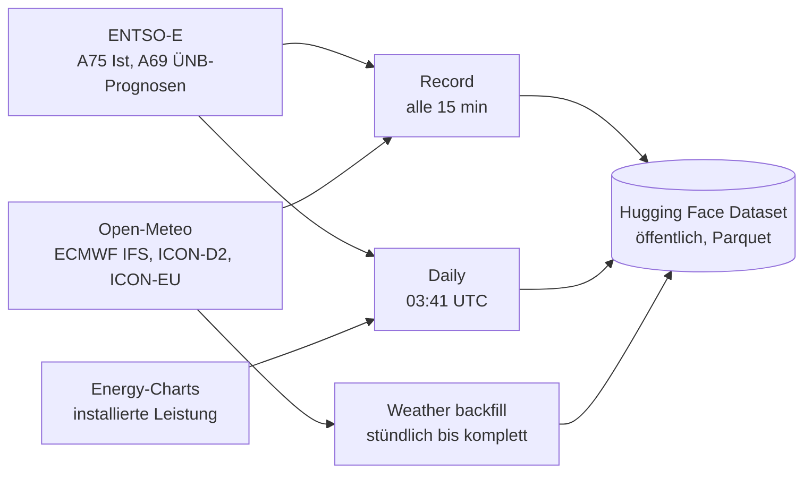

# DE Power Forecast

Prognosen für die deutsche Solar-, Wind-an-Land- und Wind-auf-See-Erzeugung
(Intraday und Day-Ahead, mit Unsicherheitsband), ehrlich gegen die Prognosen der
Übertragungsnetzbetreiber ausgewertet.

**Stand: Datenbasis.** Dieses Repo sammelt zuerst die Daten, vollautomatisch in
GitHub Actions. Modell und Website bauen darauf auf.

## Die Regel, die alles bestimmt

Jeder Wert trägt den Zeitpunkt, ab dem er verfügbar war. Eine Prognose, die um
T erstellt wird, darf nur Werte mit `seen_at` bzw. `available_at` ≤ T benutzen.
Ohne diese Regel sieht jeder Backtest besser aus, als das Modell live je sein wird.
`dpf/vintage.py` setzt das um (`as_of`, `asof_join`) und ist getestet.

## Was läuft wo



| Workflow | Zeitplan | Aufgabe |
|---|---|---|
| `record.yml` | alle 15 min | ENTSO-E-Ist (letzte 6 h) und ÜNB-Prognosen (Day-Ahead, Intraday, aktuell) für DE und die vier Regelzonen; nur neue oder geänderte Werte landen mit Zeitstempel im Vintage-Log. Jeder neue Wettermodelllauf wird einmal gespeichert. |
| `daily.yml` | täglich | ENTSO-E-Monatsdateien: letzte 35 Tage neu (Messwerte ersetzen vorläufige), Historie ab 2024-01 wird aufgefüllt. Installierte Leistung als datierter Snapshot. Health-Check. |
| `weather-backfill.yml` | stündlich | Wetterhistorie: erst Previous-Runs-Vintages ab 2024-01, dann jeder archivierte Modelllauf. Eigenes Tageslimit (8.000 von 10.000 Open-Meteo-Calls), macht nach Abbruch dort weiter, wo er aufgehört hat. |
| `model.yml` | wöchentlich | Backtest des Day-Ahead-Modells gegen die ÜNB-Prognose. |
| `keepalive.yml` | wöchentlich | Verhindert, dass GitHub die Zeitpläne nach 60 Tagen ohne Commit abschaltet. |

Nach dem Daily-Job rechnet `python -m dpf report` den Vergleichsbericht (`reports/baseline.json` im Dataset):
die Messlatte, die das Modell schlagen muss.

| Produkt | Vergleich | Hinweis |
|---|---|---|
| Day-Ahead | ÜNB-Day-Ahead (A01), gleiche Viertelstunde vorgestern, Mittel der letzten 14 Tage | ÜNB-Prognose erscheint erst 18:00 am Vortag, also nach unserem Abgabezeitpunkt |
| Intraday, 15 min bis 8 h | neueste veröffentlichte ÜNB-Prognose (Intraday A40 ab 08:00, sonst Day-Ahead), dieselbe plus ihr letzter bekannter Fehler, Persistenz | Istwert gilt 1 h nach Ende der Viertelstunde als bekannt |

Alle Vergleiche eines Produkts laufen auf denselben Viertelstunden. Grenzen stehen im Bericht selbst:
Die Historie nutzt die heutigen, gemessenen Istwerte, und Solar-„Ist“ ist in Deutschland eine Hochrechnung der ÜNB.

## Modell v1: Day-Ahead

Prognose für jede Viertelstunde des Liefertags, ausgegeben um 11:00 am Vortag (vor der
Day-Ahead-Auktion um 12:00), als P10 / P50 / P90. Eingaben: ICON-EU-Vorhersagen, die mindestens
48 h vor ihrer Gültigkeit gemacht wurden, an 16 Punkten, dazu Sonnenstand und Kalender.
Gradient Boosting (LightGBM) je Technologie auf den Kapazitätsfaktor, feste Einstellungen.
`features.build` bricht ab, sobald ein Wetterwert nach der Ausgabezeit veröffentlicht wäre.

Walk-forward-Backtest 09/2025 bis 08/2026 (jeder Monat mit einem Modell, das nur ältere Daten
kannte), mittlerer absoluter Fehler in % der installierten Leistung:

| | Solar | Wind an Land | Wind auf See |
|---|---|---|---|
| Modell v1 (Wetter ≥ 48 h alt) | 1,03 % | 3,40 % | 8,80 % |
| ÜNB Day-Ahead (erscheint 18:00, 7 h später) | 0,61 % | 1,86 % | 5,40 % |
| gleiche Viertelstunde vorgestern | 2,19 % | 12,59 % | 22,07 % |

Das P10–P90-Band enthält 77–82 % der Istwerte (Ziel 80 %). v1 schlägt einfache Regeln deutlich,
verliert aber gegen die ÜNB. Der Hauptgrund ist das Alter der Wetterdaten: v1 nutzt Läufe von
vor ≥ 48 h, die ÜNB rechnen um 18:00 mit den neuesten. v1b nimmt die neuesten Läufe, die um
11:00 verfügbar sind (ECMWF 00 UTC), sobald deren Archiv komplett ist.
`python -m dpf backtest-da` (wöchentlich, `model.yml`) schreibt `reports/model_da.json`.

Kein Rechner muss dafür laufen. Secrets: `ENTSOE_API_KEY`, `HF_TOKEN` (Repository → Settings → Secrets and variables → Actions).

## Daten

Öffentlich auf Hugging Face: [akderekaan/de-power-forecast-data](https://huggingface.co/datasets/akderekaan/de-power-forecast-data).
Layout, Spalten und Lizenzen stehen in der Dataset-Card (`dpf/dataset_card.md`).
Stand der Jobs: `status.json` und `state/*.json` im Dataset.

| Quelle | Inhalt | Verfügbar ab |
|---|---|---|
| ENTSO-E A75 | Ist-Erzeugung Solar, Wind an Land, Wind auf See, 15 min | ca. 20–50 min nach Viertelstunde, später durch Messwerte korrigiert |
| ENTSO-E A69 | ÜNB-Prognosen Day-Ahead (A01), Intraday (A40), aktuell (A18) | 18:00 D-1, 08:00 D, laufend |
| Open-Meteo | 16 Punkte (13 Regionen an Land, 3 Offshore-Standorte), 10 Variablen je Modell | Lauf + 1,5 h (ICON-D2) bis + 7,5 h (ECMWF) |
| Energy-Charts | installierte Leistung je Monat | monatlich, rückwirkend revidiert |

## Lokal

```powershell
python -m venv .venv; .venv\Scripts\Activate.ps1
pip install -r requirements-dev.txt
python -m pytest -q
```

Ein Job gegen einen lokalen Ordner statt Hugging Face:

```powershell
$env:DPF_STORE = "local:./local-store"; $env:ENTSOE_API_KEY = "..."
python -m dpf record
```

## Lizenz

Code: MIT. Daten: CC BY 4.0 mit Quellenangabe (ENTSO-E Transparency Platform, Open-Meteo, Energy-Charts).
